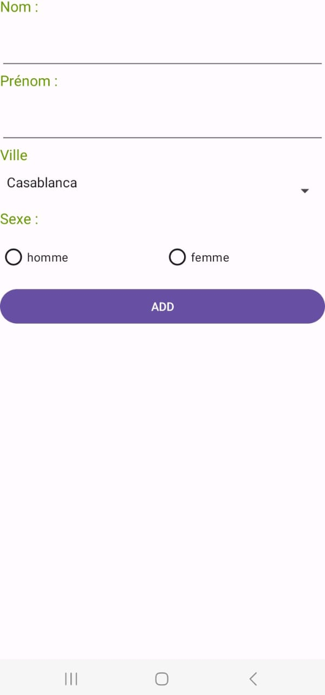

# Application pour la gestion des étudiants
Une application de gestion des étudiants dédiée à l'ajout simplifié de données étudiantes. 
elle se concentre sur une expérience utilisateur intuitive pour l'insertion efficace des informations des étudiants,
optimisant ainsi le processus d'ajout sans complications.
# Application web
L'interface web offre une expérience convaincante pour l'ajout des informations des étudiants. Elle comprend un formulaire interactif avec des champs de texte pour le nom, 
le prénom, la ville et le genre.
 
# Capture d'ecran pour l'app web
  

# Application mobile
l'application mobile offre une interface mobile conviviale qui permet aux utilisateurs d'ajouter les informations des étudiants. Elle comporte des champs clairement libellés pour le nom, 
le prénom, la date de naissance et d'autres détails. 
Les utilisateurs peuvent saisir facilement les données des étudiants .

# Capture d'ecran pour l'app mobile
  

